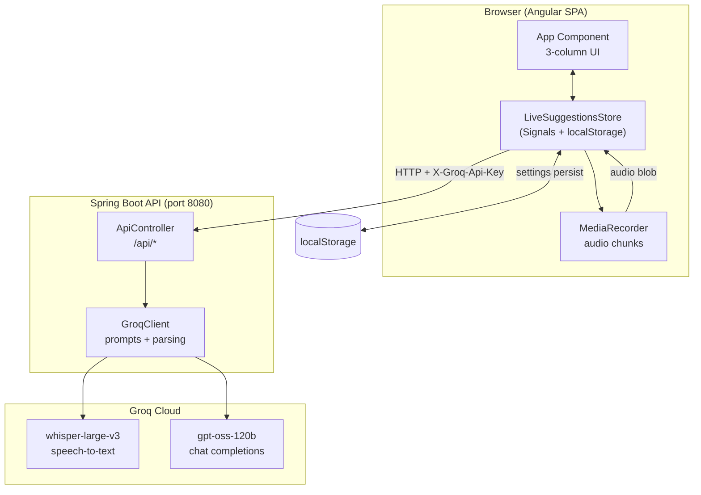
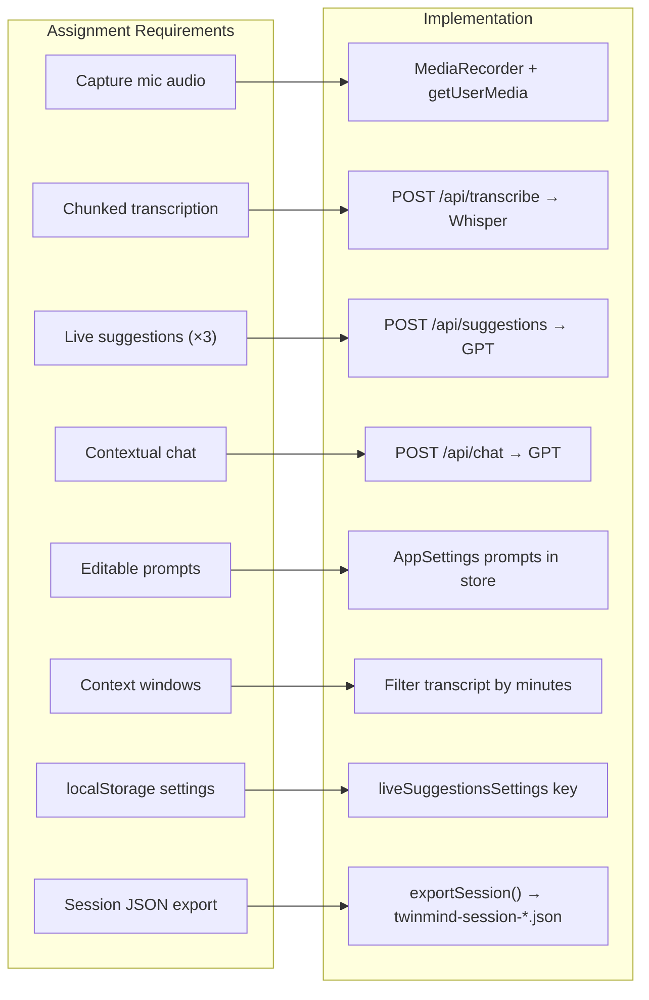
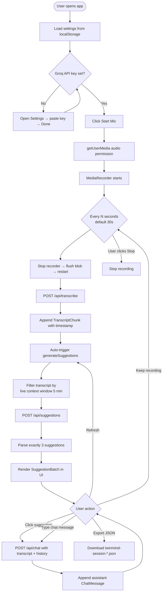
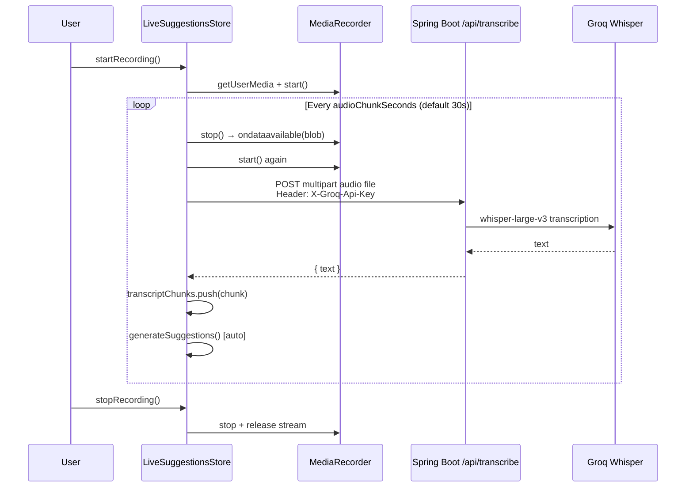
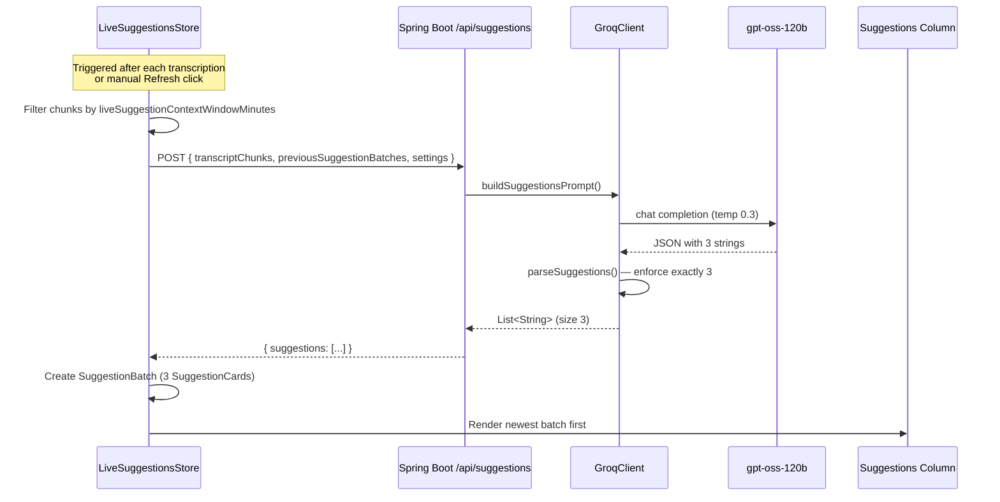
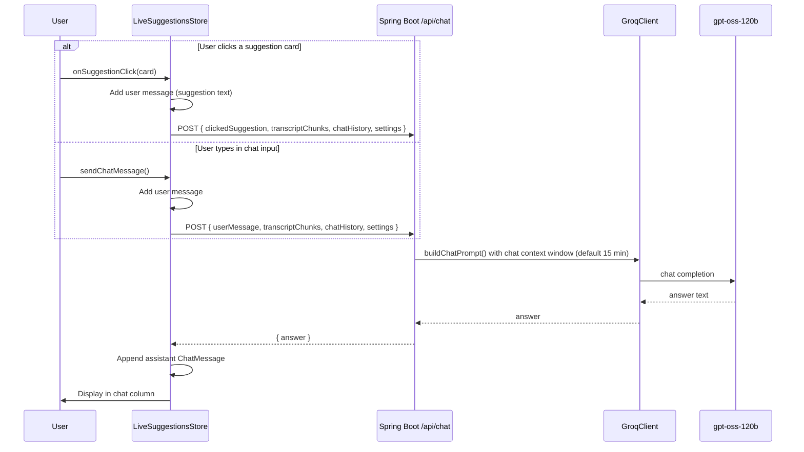
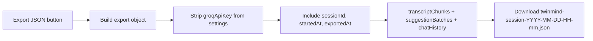
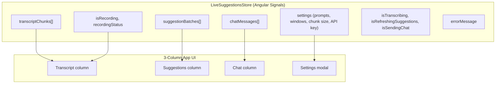
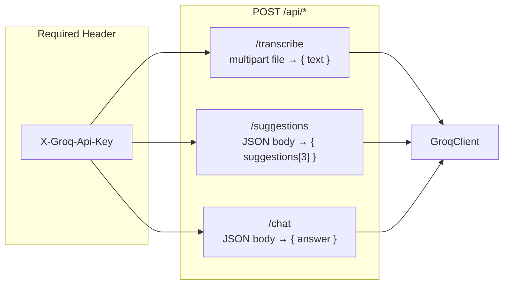
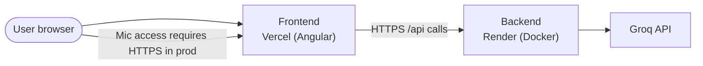

# Live Suggestions App — Flow Diagrams

How the project works end-to-end and how it fulfills the assignment requirements.

---

## 1. High-Level Architecture

**Key design choices**

| Layer | Responsibility |
|-------|----------------|
| **Angular UI** | Transcript, suggestions, and chat columns; settings modal |
| **LiveSuggestionsStore** | All business logic: recording, API calls, state, export |
| **Spring Boot** | Stateless proxy — no database, no server-side sessions |
| **Groq** | ASR (Whisper) and LLM (GPT) via OpenAI-compatible APIs |

---

## 2. Assignment Requirements Map

---

## 3. Main User Flow (End-to-End)

---

## 4. Recording & Transcription Pipeline

---

## 5. Live Suggestions Flow

**Suggestion variety (prompt strategy)**

| # | Intent |
|---|--------|
| 1 | Answer / fact / explanation |
| 2 | Follow-up question / talking point |
| 3 | Clarification / risk / fact-check |

---

## 6. Chat & Detailed Answer Flow

---

## 7. Session Export Flow

---

## 8. Frontend State Model

---

## 9. Backend API Surface

---

## 10. Deployment Topology

| Environment | Frontend | Backend API |
|-------------|----------|-------------|
| Development | `http://localhost:4200` | `http://localhost:8080/api` |
| Production | Vercel | `https://live-suggestions-backend.onrender.com/api` |

---

## Related Files

| File | Role |
|------|------|
| `frontend/src/app/live-suggestions.store.ts` | Core logic: recording, API, state, export |
| `frontend/src/app/app.html` | 3-column UI layout |
| `backend/.../controller/ApiController.java` | REST endpoints |
| `backend/.../service/GroqClient.java` | Groq integration, prompts, JSON parsing |
| `README.md` | Run instructions + assignment checklist |
